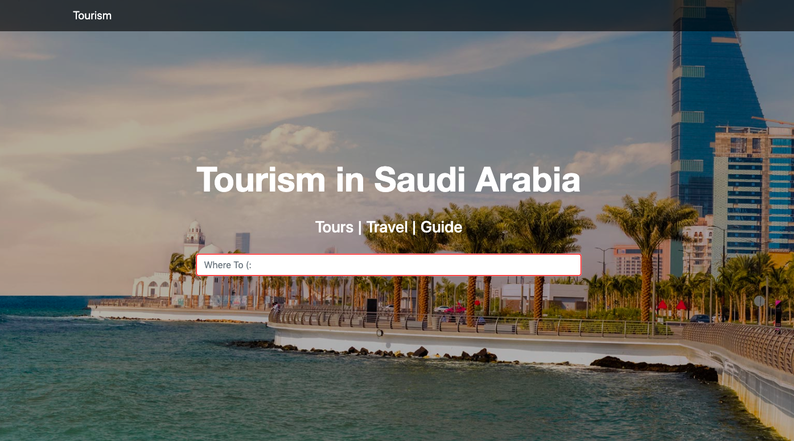
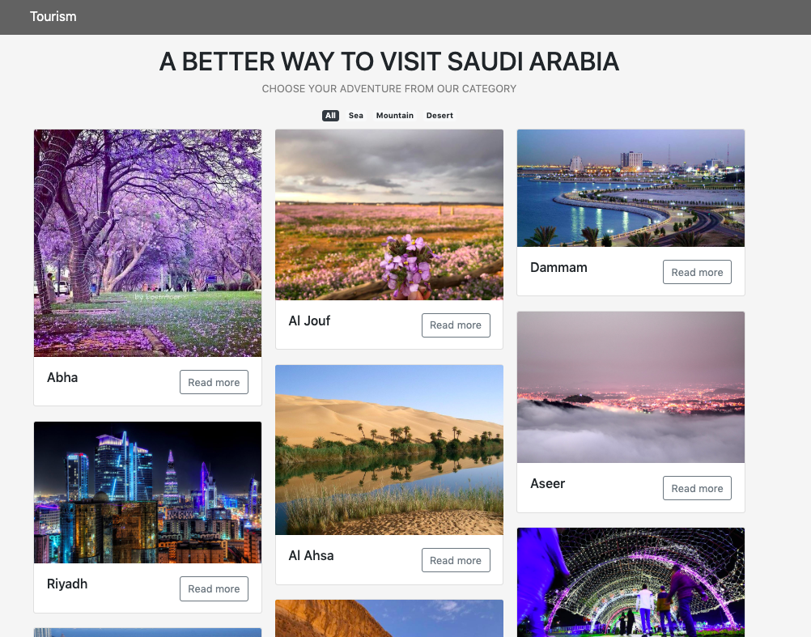

# <span > <p align="center" > Tourism Project  :airplane:  </p> </span>

## <span > <p align="center" > Need to travel soon but you don't have </p> </span>

```diff
- Visa
- Money
- Tickit
- Plan

```

## <span > <p align="center" > Not any more :surfer: Traveling is easier than you think :wink: </p> </span>

## <span > <p align="center" >  with our web application  *Tourism in Saudi Arabia*   </p> </span>
 
## <span > <p align="center" >  You could find different choices of amazing places in Saudia Arabia by one click! </p> </span>

<p align="center"></p>

<p align="center"></p>

<p align="center"></p>

## How To Use:
The goal of this project is to make it possible for users to find amazing places in Saudi Arabia. It gives information about each city along with differnt images. Also, there are some videos for differnt cities that help to get a clear idea about cities. 

## Some Features:
* User could find a city by category {Sea, Dessert, Mountain}. 
* User could find differnt information about any city.
* User could find videos for cities.
* User could search by the name of city.

## Main Technologies:
It is a full stack application using Ruby on Rails and Postgresql.
* [React](https://reactjs.org/)
* [JSON](https://www.json.org//)
* [reactstrap](https://reactstrap.github.io/)
* [Ruby on Rails](https://rubyonrails.org/)
* [JSX](https://reactjs.org/docs/introducing-jsx.html)


## :soon: Future Improvements:
* User could show famous resturants.
* User could write comments. 
* User could share images. 

## For the project:
## Requirements

- **Build a web application using create-react-app**.  Must be your own work.
- **Use React framework** to build your application with *at least* 
  - 4 components
  - 4 props
  - 2 state properties
  - 2 setState
  - 2 routes
  - 1 API call with Axios and display the data for the user.
- **Craft a `README.md` file that explains your app** to the world.
- **Recorded video demo** of your application to submit your project.

### Necessary Deliverables

Projects are due **Thursday, August 22nd at 10am**!  

Submissions will be submitted by posting into slack
- the recorded video demo 
- a link to your deployed application 
- a link to your github repository

The recorded video demo must be no longer then a **10 minute presentation** in which you answer the following questions:
  - What is the application about?
  - What are the user stories for your application?
  - What API did you choose to use?
  - Demo of the application
  - Walk through a piece of code
  - What was the most difficult part of the team project?
  - What was your favourite part of working on a team?
  - What would your team like to add next?
  
